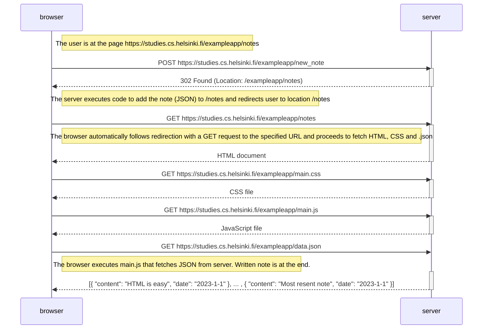

```mermaid
sequenceDiagram
	participant browser
	participant server
 
 	Note right of browser: The user is at the page  https://studies.cs.helsinki.fi/exampleapp/notes
 	browser->>server: POST https://studies.cs.helsinki.fi/exampleapp/new_note
	activate server
	server-->>browser: 302 Found (Location: /exampleapp/notes)
	deactivate server
	Note right of browser: The server executes code to add the note (JSON) to /notes and redirects user to location /notes


	browser->>server: GET https://studies.cs.helsinki.fi/exampleapp/notes
	activate server
	Note right of browser: The browser automatically follows redirection with a GET request to the specified URL and proceeds to fetch HTML, CSS and .json
	server-->>browser: HTML document
	deactivate server
    
	browser->>server: GET https://studies.cs.helsinki.fi/exampleapp/main.css
	activate server
	server-->>browser: CSS file
	deactivate server
	
	browser->>server: GET https://studies.cs.helsinki.fi/exampleapp/main.js
	activate server
	server-->>browser: JavaScript file
	deactivate server

	browser->>server: GET https://studies.cs.helsinki.fi/exampleapp/data.json
	Note right of browser: The browser executes main.js that fetches JSON from server. Written note is at the end.
        activate server
	server-->>browser: [{ "content": "HTML is easy", "date": "2023-1-1" }, ... , { "content": "Most resent note", "date": "2023-1-1" }]
	deactivate server
```
